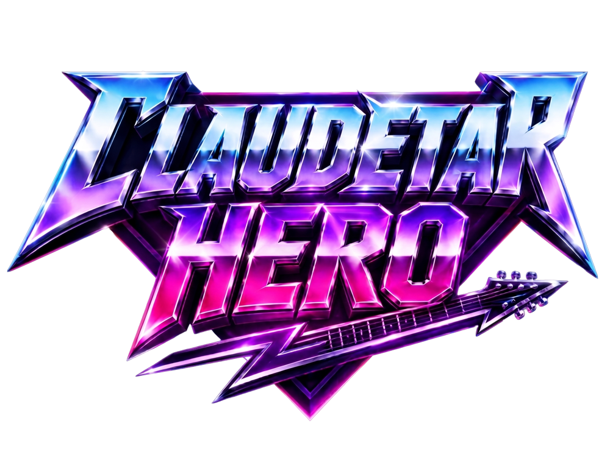

<p align="center">
  
</p>

<p align="center"><strong>Play it now: <a href="https://claudetarhero.com">claudetarhero.com</a></strong></p>

A Guitar Hero–style rhythm game that runs entirely in the browser and can chart
**any song**. Type a search, pick a track, and the game pulls a free 30-second
preview from the iTunes Search API and generates a chart from the audio on the
fly.

Rendered with [three.js](https://threejs.org): a neon note highway with a
custom GLSL shader, bloom post-processing, particle bursts, shockwave rings,
sustain trails, and a starfield.

You can also **drag and drop a `.sng` chart package** onto the page to play it
with its real chart and bundled audio. The game is fully **playable on phones**,
too, with on-screen fret and Star Power controls and a responsive,
viewport-aware layout.

## Controls

| Key | Action |
| --- | --- |
| `A` `S` `D` `F` `G` (or `1`–`5`) | Frets — green / red / yellow / blue / orange |
| `Space` | Activate Star Power (when the meter is ≥ 50%) |
| `Esc` | Quit to menu |

- Hold fret keys through **sustain notes** (long tails) for trickle points.
- Consecutive hits build a **streak**; every 10 raises your multiplier, up to **x4**.
- **Star Power** doubles your multiplier and turns the highway blue while it drains.
- The **rock meter** climbs on hits and drops on misses. Hit zero and you're booed off stage.
- Misses muffle the song through a lowpass filter and play a clank, like the original.

## Scoring

| Event | Points |
| --- | --- |
| Note hit (within ±140 ms) | 50 × multiplier |
| Perfect hit (within ±55 ms) | 75 × multiplier |
| Sustain hold | 30/sec × multiplier |
| Overstrum / miss | streak resets |

Results are graded 1–5 stars by accuracy (97%+ = 5★).

## How charts are generated

The game writes its own chart from the raw audio:

1. **Decode.** The 30 s AAC preview is decoded to PCM with the Web Audio API.
2. **STFT.** A short-time Fourier transform (2048-sample Hann windows, 512 hop,
   radix-2 FFT written in plain JS) produces per-frame magnitude spectra.
3. **Spectral flux.** Positive magnitude change per frame is summed in five
   frequency bands — kick (0–120 Hz), low (120–400), mid (400–1200),
   high-mid (1200–4000), treble (4000–11000) — which map 1:1 onto the five
   fret lanes, so kick drums land on green and cymbals land on orange.
4. **Onset detection.** Peaks in total flux are picked against an adaptive
   local-mean threshold (1.45× the surrounding 21-frame mean).
5. **Tempo.** BPM is estimated by autocorrelating the flux signal across
   60–200 BPM lags, with a mild bias toward ~120 to avoid half/double-time
   errors. Onsets snap to a 16th-note grid anchored on the strongest onset.
6. **Charting.** Difficulty filters onset density (Easy keeps the strongest
   45%, Expert keeps everything, with per-difficulty minimum note gaps), lane
   jumps are clamped on fast runs so patterns stay hand-friendly, the
   strongest ~15% of hits become two-note chords, and strong onsets followed
   by long gaps become sustains.

A built-in fallback track ("Neon Overdrive") is synthesized locally with an
`OfflineAudioContext` — drums, bass, and detuned-saw lead — and charted by the
same pipeline, so the game is fully playable offline.

## Architecture

```
index.html          screens + HUD markup
src/main.js         state machine: menu → loading → gameplay → results
src/itunes.js       iTunes Search API client (via the proxy)
src/analysis.js     FFT, spectral flux, onset/tempo detection, chart generator
src/demo.js         OfflineAudioContext synth demo track
src/game.js         three.js engine: highway shader, gem/tail/particle pools,
                    bloom, input (keyboard + touch), scoring, star power,
                    rock meter
src/sng.js          .sng chart-package reader (metadata + embedded files)
src/chart.js        .chart / .mid chart parser for dropped .sng packages
src/style.css       HUD + menu styling
api/proxy.js        Vercel serverless function: proxies iTunes search and
                    preview audio around CORS (also imported by a Vite dev
                    middleware so dev === prod)
```

Implementation notes:

- **Timing** is driven by `AudioContext.currentTime`, not `requestAnimationFrame`
  clocks, so note positions can't drift from the music. A note's Z position is
  simply `(noteTime − songTime) × speed`.
- **Object pooling** everywhere: gems, sustain tails, particles, and shockwave
  rings are preallocated and recycled — zero allocations in the render loop.
- The highway is a single `ShaderMaterial` plane: lane dividers, edge glow, and
  beat lines (spaced by detected BPM) scrolling toward the player, pulsing on
  the beat, tinting cyan during Star Power.
- Post-processing is `EffectComposer` + `UnrealBloomPass`; bloom strength
  eases up while Star Power is active.
- The iTunes Search API needs no key and returns preview URLs for virtually
  any track; the tiny proxy exists only because neither the search endpoint
  nor the preview CDN sends permissive CORS headers reliably.

## Run locally

```bash
npm install
npm run dev      # http://localhost:5173
```

## Deploy to Vercel

```bash
npm i -g vercel
vercel --prod
```

The Vite framework preset is auto-detected and `api/proxy.js` deploys as a
serverless function — no configuration required.

## License

Released under the [MIT License](LICENSE).
